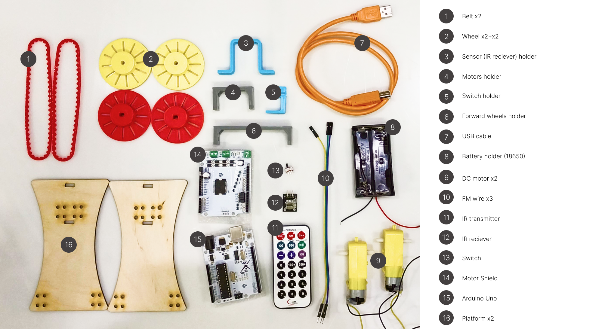

# Робот-хужожник
Робот рисует квадрат
## Сборка

Детали напечатаны на 3D-принтере из PLA

Электроника - Arduino, Амперка


Рисунок 1 - Элементы сборки

## Программа

**Код нахождения кнопок**
```C++
#include <IRremote.hpp>
#define IR_RECEIVE_PIN 0

void setup(){
  Serial.begin(9600);
  IrReceiver.begin(IR_RECEIVE_PIN);
}

void loop(){
   if (IrReceiver.decode()) {
      IrReceiver.resume(); // Enable receiving of the next value
      //Serial.println(IrReceiver.decodedIRData.decodedRawData, HEX);
      Serial.println(IrReceiver.decodedIRData.command);
  }
}
```

**Код траектории движения по квадрату**
```C++
#include <IRremote.hpp>

#define IR_RECEIVE_PIN 0
#define IR_BUTTON_PLUS 21
#define IR_BUTTON_MINUS 69

#define SPEED_1      5 
#define DIR_1        4

#define SPEED_2      6
#define DIR_2        7

void setup(){
  Serial.begin(9600);
  IrReceiver.begin(IR_RECEIVE_PIN);

  for (int i = 4; i < 8; i++) {     
    pinMode(i, OUTPUT);
  }
}

void loop(){
   if (IrReceiver.decode()) {
      IrReceiver.resume(); // Enable receiving of the next value
      int command = IrReceiver.decodedIRData.command;
      
      switch (command) {
         case IR_BUTTON_PLUS: { 
          digitalWrite(DIR_1, LOW); // set direction
          analogWrite(SPEED_1, 200); // set speed

          digitalWrite(DIR_2, HIGH); // set direction
          analogWrite(SPEED_2, 200); // set speed поехали прямо

          delay(700);

          digitalWrite(DIR_1, HIGH); // set direction
          analogWrite(SPEED_1, 200); // set speed

          delay(700);

          digitalWrite(DIR_1, LOW); // set direction
          analogWrite(SPEED_1, 200); // set speed

          delay(700);

          digitalWrite(DIR_1, HIGH); // set direction
          analogWrite(SPEED_1, 200); // set speed

          delay(700);

          analogWrite(SPEED_1, 0); 
          analogWrite(SPEED_2, 0);  
          
          break;
        }
        case IR_BUTTON_MINUS: { // stop mototrs
          analogWrite(SPEED_1, 0); 
          analogWrite(SPEED_2, 0);  
          break;
        }
      }
  }
}
```

**Видео-подтверждение**

https://github.com/Darya-Akhiyarova/Bot/assets/144244924/ab5fb75d-af2e-4339-9ede-965fb764462c

**Примечание**
- Недочет при сборке заключался в отсуствии некоторых отверстий под крепеж, которые были сделаны с помощью щуруповерта. 
- Колеса, сидящие на приводе были скошены под углом.
- Квадрат не смыкался.
